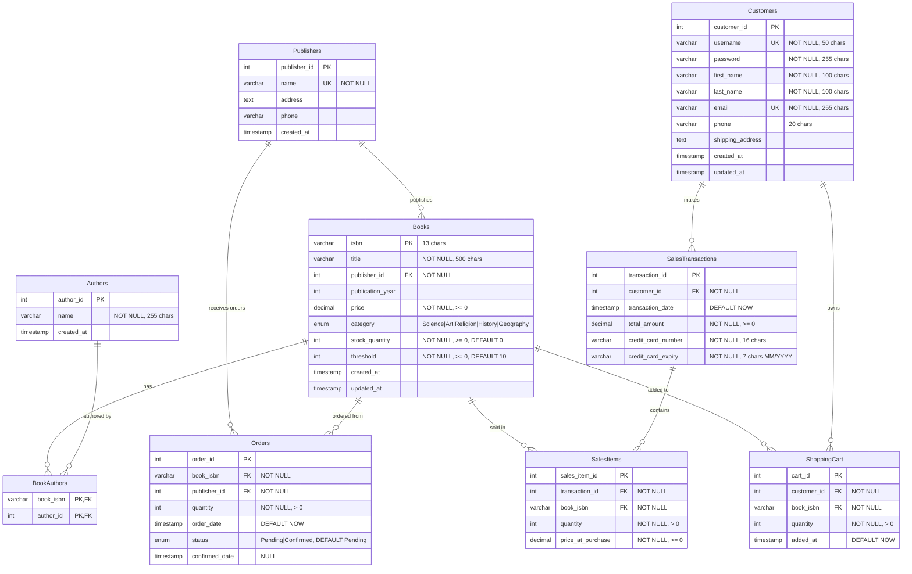

# Database Entity Relationship Diagram

## Overview

This document provides a visual representation of the Order Processing System database schema using Mermaid ERD format.

## Entity Relationship Diagram

## Relationships Explained

### One-to-Many Relationships

1. **Publishers → Books** (1:N)
   - One publisher can publish multiple books
   - Each book has exactly one publisher
   - Foreign Key: `Books.publisher_id` → `Publishers.publisher_id`

2. **Publishers → Orders** (1:N)
   - One publisher can receive multiple orders
   - Each order is for one publisher
   - Foreign Key: `Orders.publisher_id` → `Publishers.publisher_id`

3. **Books → Orders** (1:N)
   - One book can have multiple orders (restocking)
   - Each order is for one book
   - Foreign Key: `Orders.book_isbn` → `Books.isbn`

4. **Books → SalesItems** (1:N)
   - One book can appear in multiple sales
   - Each sales item is for one book
   - Foreign Key: `SalesItems.book_isbn` → `Books.isbn`

5. **Books → ShoppingCart** (1:N)
   - One book can be in multiple shopping carts
   - Each cart item contains one book
   - Foreign Key: `ShoppingCart.book_isbn` → `Books.isbn`

6. **Customers → SalesTransactions** (1:N)
   - One customer can make multiple purchases
   - Each transaction belongs to one customer
   - Foreign Key: `SalesTransactions.customer_id` → `Customers.customer_id`

7. **Customers → ShoppingCart** (1:N)
   - One customer can have multiple items in cart
   - Each cart item belongs to one customer
   - Foreign Key: `ShoppingCart.customer_id` → `Customers.customer_id`

8. **SalesTransactions → SalesItems** (1:N)
   - One transaction can contain multiple items
   - Each sales item belongs to one transaction
   - Foreign Key: `SalesItems.transaction_id` → `SalesTransactions.transaction_id`

### Many-to-Many Relationship

1. **Books ↔ Authors** (M:N)
   - One book can have multiple authors
   - One author can write multiple books
   - Junction Table: `BookAuthors`
   - Foreign Keys:
     - `BookAuthors.book_isbn` → `Books.isbn`
     - `BookAuthors.author_id` → `Authors.author_id`

## Database Triggers

### 1. before_update_books_check_stock
- **Type**: BEFORE UPDATE on Books
- **Purpose**: Prevents stock quantity from becoming negative
- **Action**: Raises error if `NEW.stock_quantity < 0`

### 2. after_update_books_auto_order
- **Type**: AFTER UPDATE on Books
- **Purpose**: Automatically places order when stock drops below threshold
- **Condition**: `OLD.stock_quantity >= OLD.threshold AND NEW.stock_quantity < NEW.threshold`
- **Action**: Inserts new order with quantity = 50 (constant)

### 3. after_update_orders_confirm
- **Type**: AFTER UPDATE on Orders
- **Purpose**: Updates stock when order is confirmed
- **Condition**: `OLD.status = 'Pending' AND NEW.status = 'Confirmed'`
- **Action**: Increases book stock by order quantity

## Constraints

### Primary Keys (PK)
- All tables have primary keys for unique identification
- Composite PK in `BookAuthors` (book_isbn, author_id)
- Composite UNIQUE in `ShoppingCart` (customer_id, book_isbn)

### Foreign Keys (FK)
- All relationships enforced with foreign key constraints
- `ON DELETE CASCADE` for dependent data (cart items, book-author links)
- `ON DELETE RESTRICT` for critical references (publishers, customers)

### Check Constraints
- `Books.price >= 0`
- `Books.stock_quantity >= 0`
- `Books.threshold >= 0`
- `Orders.quantity > 0`
- `SalesItems.quantity > 0`
- `SalesTransactions.total_amount >= 0`
- `ShoppingCart.quantity > 0`

### Unique Constraints
- `Publishers.name`
- `Books.isbn` (also PK)
- `Customers.username`
- `Customers.email`
- `ShoppingCart` (customer_id, book_isbn) combination

## Indexes

Performance indexes are created on:
- `Books.category`
- `Books.publisher_id`
- `Books.stock_quantity`
- `Orders.status`
- `Orders.book_isbn`
- `SalesTransactions.customer_id`
- `SalesTransactions.transaction_date`
- `SalesItems.transaction_id`
- `SalesItems.book_isbn`
- `ShoppingCart.customer_id`

## Database Normalization

The schema follows **Third Normal Form (3NF)**:
- ✅ First Normal Form: All attributes are atomic (no repeating groups)
- ✅ Second Normal Form: No partial dependencies (all non-key attributes depend on entire primary key)
- ✅ Third Normal Form: No transitive dependencies (no non-key attribute depends on another non-key attribute)

### Example: Book-Author Separation
- Instead of storing authors as comma-separated values in Books table
- We use a separate Authors table and BookAuthors junction table
- This eliminates data redundancy and allows efficient querying
